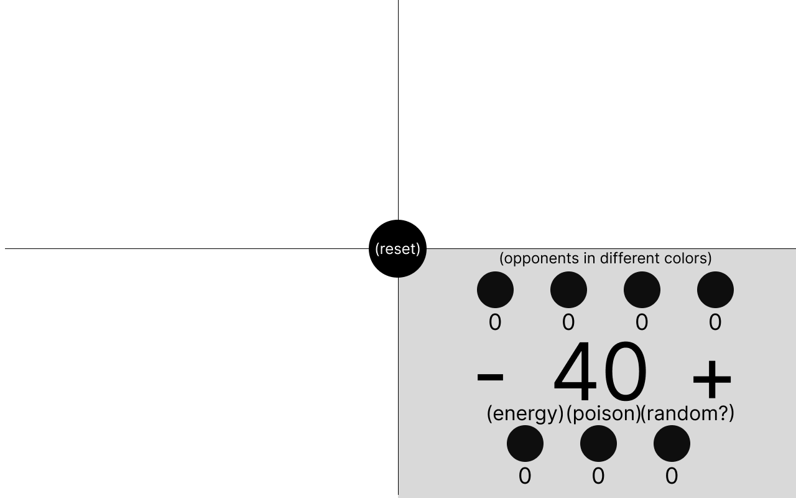

# mtg-edh-life-counter
Learning project, I try to code app that can track life counters in MTG games

The wireframe prototype of the idea is attached. It shows only one of the players, but everyone should have the same layout, only in different colors.

